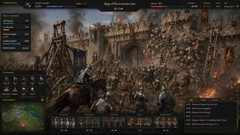
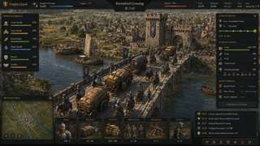
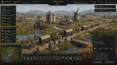

# Empire Quest — Global Visual Quality Gate

> **STATUS: LOCKED**  
> **Scope:** the entire game, not only battles.

## Non-negotiable directive

Empire Quest must meet or exceed the benchmark images in this document across every major playable surface. If a screen does not meet this quality floor, it does not pass.

Do **not** ship weak intermediate visuals and expect hundreds of “improve it” iterations to establish the target later. The target is defined here from the beginning.

The benchmark images below are lightweight repository reference copies of the exact project-owner benchmark screenshots. Their composition, density, fidelity, atmosphere, UI treatment, and overall finished-game quality are the canonical comparison; JPEG compression of these repo copies is not the quality target.

## Benchmark 1 — Rivermarch Gate



**Applies to:** siege, battle, destruction, castle/wall combat, breach views.

Required:

- AAA-looking stonework, gates, crenellations, rubble, and readable structural detail.
- Crowded, active battlefield — never sparse.
- Visible siege engines, ladders, engineers, cavalry, infantry, archers, and support activity as simulation state demands.
- Smoke, fire, dust, embers, debris, weather, strong lighting, and atmospheric depth.
- Local physical destruction, breaches, collapse, and persistent rubble.
- Premium strategy HUD that remains readable over cinematic action.
- Tactical state must be visible in the world, not merely numerical.
- Unit scale, armor, poses, and battlefield composition must feel believable and finished.

## Benchmark 2 — Ravenford Crossing



**Applies to:** convoy/logistics, bridges, river crossings, route protection, towns, escort operations.

Required:

- Dense, believable bridge/town/river environment.
- Wagons, cargo, escorts, horses, civilians, guards, merchants, and route activity visibly present as appropriate.
- Strong water, terrain, architecture, road, and background-world fidelity.
- Route, cargo, threat, escort, health, timing, and event information immediately readable.
- The scene must feel like a living physical logistics system, not a menu over a backdrop.
- Infrastructure should visibly carry and constrain the simulation.

## Benchmark 3 — Goldmere Fields



**Applies to:** province economy, farms, industry, villages, supply movement, non-combat world scenes.

Required:

- Premium rural environment with farms, crops, mills, silos, buildings, roads, water, bridges, animals, and terrain detail.
- Visible workers, animals, wagons, soldiers, transport, and production activity as simulation state demands.
- Dense, lived-in economy rather than empty terrain.
- Province health, food, water, morale, transport, convoy, supply, and event state readable in the UI.
- Production and logistics should be seen in the world, not only listed in panels.

## Whole-game visual doctrine

**Every playable screen in Empire Quest must look like premium finished key art integrated into a real strategy game UI.**

The benchmark standard applies to:

- battles and sieges
- convoys and logistics
- provinces and farms
- castles and towns
- roads, bridges, rivers, ports, and crossings
- army and command screens
- strategic and regional views
- operational and event scenes
- industry, storage, trade, transport, and production
- HUDs, panels, maps, tooltips, and interaction overlays

This is the **baseline product standard**, not an occasional showcase mode.

## Acceptance gate

| Category | Minimum pass |
| --- | ---: |
| Environment fidelity | **9/10** |
| Scene density | **9/10** |
| UI polish | **9/10** |
| Readability | **9/10** |
| Strategic atmosphere | **9/10** |
| Overall premium feel | **9.5/10** |

A scene scoring **7/10 or 8/10 is not approved**.

## Automatic rejection triggers

Reject, regenerate, or rebuild if the result is:

- sparse
- blocky
- placeholder-like
- visibly low-detail
- underpopulated
- flat or underlit
- cheap-looking
- disconnected from simulation state
- visually repetitive in a way that destroys world believability
- beautiful but unreadable as a game
- “good enough for now”

The correct response to a failed visual is not to lower the target. The visual is rejected until it meets the benchmark.

## Simulation visibility requirement

The player should **see the systems**, not only read them in numbers.

Examples include:

- crop health and harvest state
- transport flow and congestion
- convoy composition and cargo
- escorts and threat exposure
- bridge and road condition
- castle and wall damage
- town vitality and activity
- morale pressure
- food, water, storage, and supply pressure
- repair and construction activity
- weather and time effects

Visual fidelity and simulation legibility must reinforce each other.

## RenderBlock implication

The Semantic RenderBlock Engine is not successful merely because it can render an object. It passes only when it can produce this visual quality across the whole simulation.

```text
simulation
   ↓
semantic RenderBlocks
   ↓
scale-appropriate 2D / 2.5D / directional impostor / hybrid 3D representation
   ↓
benchmark-level finished scene
```

Simulation remains authoritative. High visual quality must **not** fake or override troop counts, structural damage, cargo, route state, production, passability, morale, supplies, weather, time, or other game state.

RenderBlock assets should be authored so the game can preserve the benchmark quality while still binding visible regions to real simulation objects, structural IDs, damage states, anchors, collision/nav proxies, and persistent state.

## Primary benchmark mapping

| Benchmark | Primary systems |
| --- | --- |
| **Rivermarch Gate** | siege, destruction, combat density |
| **Ravenford Crossing** | convoy, bridge, logistics, route protection |
| **Goldmere Fields** | economy, province, farms, supply movement |

When a new screen is built, assign it to one or more benchmark families and grade it before approval.

## Final lock

> **If it is not at this level or better, do not ship it.** Empire Quest should not require hundreds of later visual-improvement prompts to discover its quality target. These benchmarks establish that target now, for the whole game.
